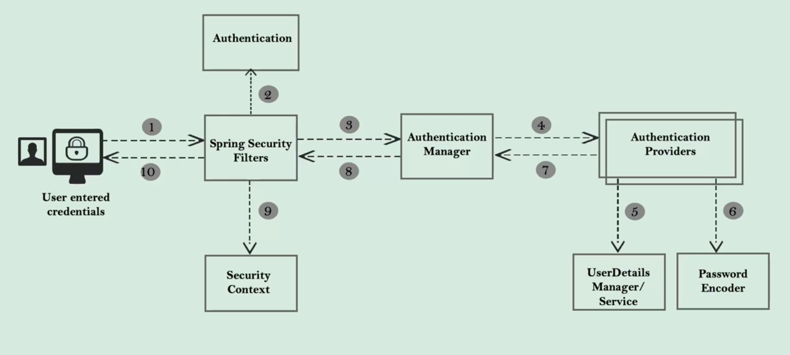
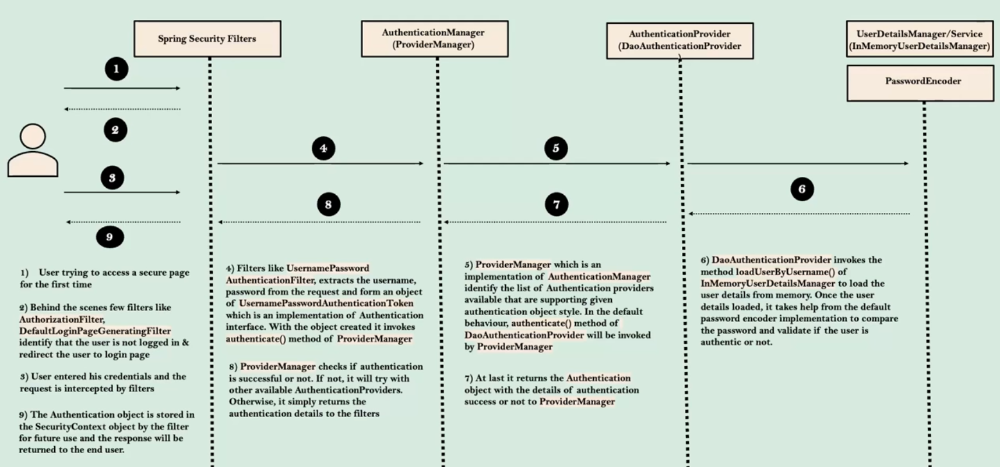
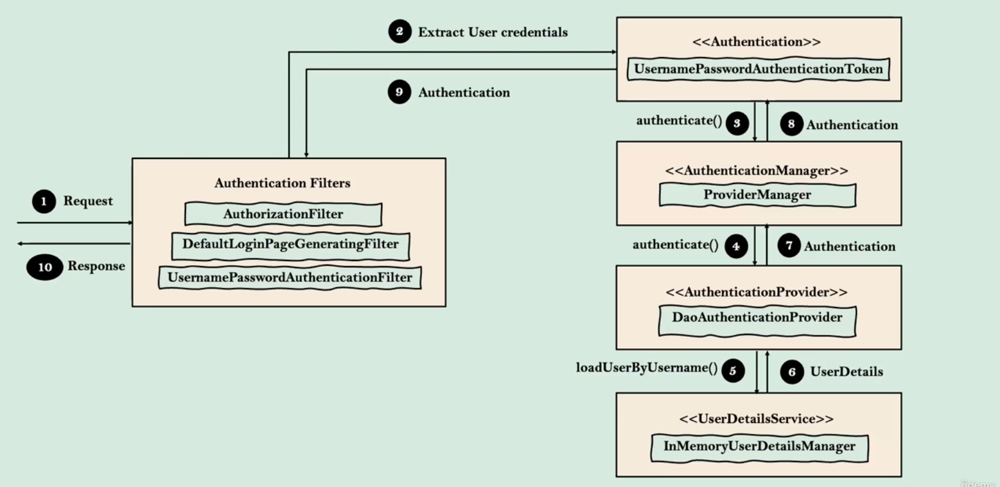
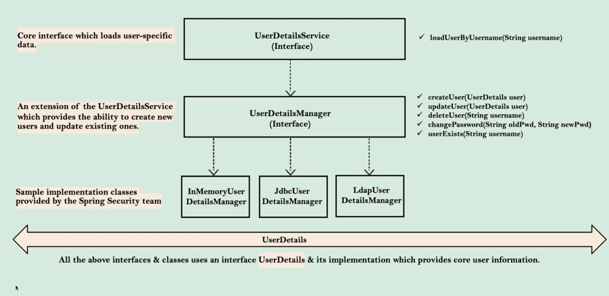

# Spring Security

## why spring security?

Application security is not fun and its challenging to implement with our custom code

Spring Security built by a team at Spring who are good at security scenarios. Using Spring security we can secure web
apps
with minimum configurations. So there is no need to re-invent the wheel here

Spring security handles common security vulnerabilities like CSRF, CORS etc. For any security vulnerabilities
identified, the framework will be patched immediately as it is being used by many organizations

It helps us secure our pages/API paths, enforce roles, method level security etc with minimum configurations

It supports various standards of security to implement authentication, like using username/password authentication, JWT
tokens, OAuth2, OpenID

## Spring Security Internal Flow

### Spring Security Filters

These are a series of filters that intercept each request and work together to identify if authentication is required or
not, if authentication is required, accordingly navigate user to login page or use existing details stored during
initial authentication

### Authentication

Filters like UsernamePasswordAuthenticationFilter will extract username/password from the HTTP request and prepare
Authentication type object

### Authentication Manager

Once received request from filter, it delegates the validating of the user details to the available authentication
providers available

### Authentication Provider

It has the core logic of validating user details for authentication

### UserDetailsManager/UserDetailsService

Helps in retrieving, creating, updating, deleting the user details from the DB/storage systems

### PasswordEncoder

Service interface that helps in encoding and hashing the password

### Security Context

Once the request has been authenticated, the authentication will usually be stored in a thread-local securityContext
managed by SecurityContextHolder
This helps during the upcoming requests from the user

## Sequence flow

**high-level detail**

## User management

Important classes and Interfaces

