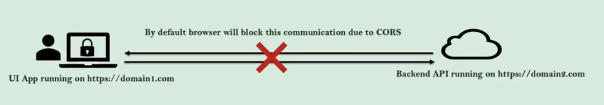
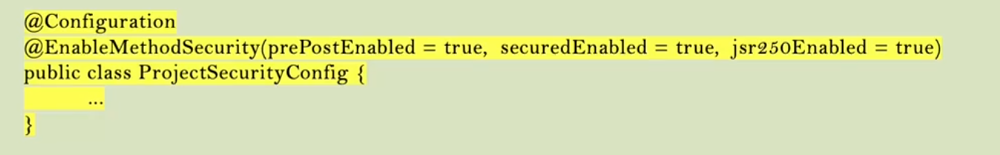
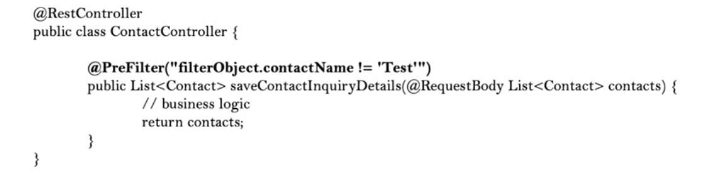

# Spring Security

## why spring security?

Application security is not fun and its challenging to implement with our custom code

Spring Security built by a team at Spring who are good at security scenarios. Using Spring security we can secure web
apps
with minimum configurations. So there is no need to re-invent the wheel here

Spring security handles common security vulnerabilities like CSRF, CORS etc. For any security vulnerabilities
identified, the framework will be patched immediately as it is being used by many organizations

It helps us secure our pages/API paths, enforce roles, method level security etc with minimum configurations

It supports various standards of security to implement authentication, like using username/password authentication, JWT
tokens, OAuth2, OpenID

## Spring Security Internal Flow


### Spring Security Filters

These are a series of filters that intercept each request and work together to identify if authentication is required or
not, if authentication is required, accordingly navigate user to login page or use existing details stored during
initial authentication

### Authentication

Filters like UsernamePasswordAuthenticationFilter will extract username/password from the HTTP request and prepare
Authentication type object

### Authentication Manager

Once received request from filter, it delegates the validating of the user details to the available authentication
providers available

### Authentication Provider

It has the core logic of validating user details for authentication

### UserDetailsManager/UserDetailsService

Helps in retrieving, creating, updating, deleting the user details from the DB/storage systems

### PasswordEncoder

Service interface that helps in encoding and hashing the password

### Security Context

Once the request has been authenticated, the authentication will usually be stored in a thread-local securityContext
managed by SecurityContextHolder
This helps during the upcoming requests from the user

## Sequence flow


**high-level detail**


## User management

Important classes and Interfaces


### Password Management

#### Encoding

Encoding refers to the process of converting data from one form to another and has nothing to do with cryptography

it involves no secret and completely reversible

Encoding can't be used for securing data.

Encoding algorithms include:
ASCII, BASE64, UNICODE

#### Encryption

Its defined as the process of transforming data in such a way that guarantees confidentiality

To achieve confidentiality, encryption requires the use of a secret which, in cryptographic terms, we call key.

Encryption can be reversible by using decryption with the help of the key
As long as the key is confidential, encryption can be considered as secured

#### Hashing

In hashing, data is converted to the hash value using some hashing function

Data once hashed is non-reversible. One cannot determine the original data from a hash value generated

Given some arbitrary data along with the output of the hashing algorithm, one can verify whether the data matches the
original input data without needing to see the original data

## Cross-Origin Resource Sharing (CORS)

This is a protocol that enables scripts running on a browser client to interact with resources from a different origin

For Example, if an App UI tries to make an API call on a different domain, it would be blocked from doing so by default
due to CORS

CORS is not a security issue/attack but the default protection provided by browsers to stop sharing the
data/communication between different origins

different origins means

* a different scheme (HTTP or HTTPS)
* a different domain
* a different port



### How to fix

* **use @CrossOrigin annotation as follows**

```
@CrossOrigin(origins = "http://localhost:4200") // this allows a specified domain
@CrossOrigin(origins = {"http://localhost:3000", "http://another-frontend.com"}) // it will allow the listed origins
@CrossOrigin(origins = "*") // this allows any domain
```

This is a tedious job in a large application

* **Global cors handling**

we start by defining a bean of type CorsConfigurationSource where we set the required cors config

such as

```
 @Bean
    public CorsConfigurationSource corsConfigurationSource() {
        CorsConfiguration corsConfiguration = new CorsConfiguration();
        corsConfiguration.setAllowedOrigins(List.of("http://localhost:4200"));
        corsConfiguration.setAllowedMethods(List.of("GET", "POST"));
        corsConfiguration.setAllowCredentials(true);
        corsConfiguration.setAllowedHeaders(Collections.singletonList("*"));
        UrlBasedCorsConfigurationSource source = new UrlBasedCorsConfigurationSource();
        source.registerCorsConfiguration("/**", corsConfiguration);
        return source;
    }
```

then configure in the securityfilterchain bean such as

```
  @Bean
    public SecurityFilterChain securityFilterChain(HttpSecurity http) throws Exception {
        http.cors(Customizer.withDefaults()); // by default, uses a Bean by the name of corsConfigurationSource
        return http.build();
    }
```

## Authentication and Authorization

| Aspect               | Authentication                                      | Authorization                                    |
|----------------------|-----------------------------------------------------|--------------------------------------------------|
| **Purpose**          | Verify users' identity for system access            | Verify users' authorities for resource access    |
| **Sequence**         | Before Authorization                                | After Authentication                             |
| **Input**            | User's login details                                | User's privilege or roles                        |
| **Failure Response** | 401 error                                           | 403 error                                        |
| **Example**          | Bank customer/employee proving identity for actions | Logged-in user's roles determine allowed actions |

## Configuring Authorities

* hasAuthority() -> Accepts a single authority for which the endpoint will be configured and user will be validated
  against
  the single authority mentioned. Only users having the same authority can invoke the endpoint

* hasAnyAuthority() -> Accepts multiple authorities for which the endpoint will be configured and user will be validated
  aganist the authorities mentioned. Only users having any of the configured authorities will invoke the endpoint

* access() -> using Spring Expression Language (SpEL) it provides you unlimited opportunities of configuring authorities
  which are not possible with the above methods. We can use operators like OR, AND inside access() method.

## Authority vs Role

| Term            | Definition                                  | Example                |
|-----------------|---------------------------------------------|------------------------|
| **Authority**   | Individual privilege or action              | VIEWACCOUNT, VIEWCARDS |
| **Description** | Restricts access in a fine-grained manner   |                        |
| **Role**        | Group of privileges/actions                 | ROLE_ADMIN, ROLE_USER  |
| **Description** | Restricts access in a coarse-grained manner |                        |

The names of authorities /roles are arbitrary in nature, and these names can be customized as per the business
requirement
Roles are also represented using the same contract GrantedAuthority in spring security,
When defining a role, its name should start with ROLE_  prefix, this prefix specifies the difference between a role and
an authority

### Role Configuration

In Spring Security, you can configure role requirements for endpoints using the following methods:

- **hasRole()**
    - Accepts a single role name for configuring the endpoint.
    - Users will be validated against the specified role.
    - Only users with the exact role configured can invoke the endpoint.

- **hasAnyRole()**
    - Accepts multiple roles for configuring the endpoint.
    - Users will be validated against any of the specified roles.
    - Allows access for users with any of the configured roles.

- **access()**
    - Utilizes Spring Expression Language (SpEL) to provide unlimited possibilities for role configuration.
    - Allows the use of operators like OR and AND inside the access() method.
    - Offers flexibility beyond the constraints of hasRole() and hasAnyRole().

**Note:**

- The `ROLE_` prefix is used when configuring roles in the database.
- When configuring roles, use only the role name without the prefix.
- The `access()` method can be employed not only for configuring authorization based on authority or role but also for
  handling special requirements. For instance, access can be configured based on the user's country or the current
  time/date.

## Method Level security

Method level security allows applying the authorization rules at any layer of the application like in service layer or
repository layer
Method level security can be enabled using annotation @EnableMethodSecurity on the configuration class

Method level security provides the below approaches to apply the authorization rules and executing your business logic

* Invocation authorization -> validates if someone can invoke a method or not based on their roles or authorities
* Filtering authorization -> validates what a method can receive through its parameters and what the invoker can receive
  back from the method post business logic exception

Spring security will use the aspects from AOP module and have the interceptors in between the method invocation to apply
the authorization rules configured

Method level security offers below 3 different styles for configuring the authorization rules on top of the methods

* The prePostEnabled property enables SpringSecurity @PreAuthorize & @PostAuthorize annotations
* The securedEnabled property enables @Secured annotation
* The jsr250Enabled property enables @RoleAllowed annotation



@Secured and @RoleAllowed are less powerful compared to @PreAuthorize and @PostAuthorize

@PreFilter
used in a scenario where we dont need to control the invocation of the method but we want to make sure that the parameters sent are recieved to/from the method need to follow authorization rules or filtering cretria, the we can consider filtering

For filtering the parameters before calling the method we can use PreFilter annotation,  
But please note that the filter object should be of type Collection interface



The @PostFilter can also be used on spring Data repository methods as well to filter any unwanted data coming from the database


